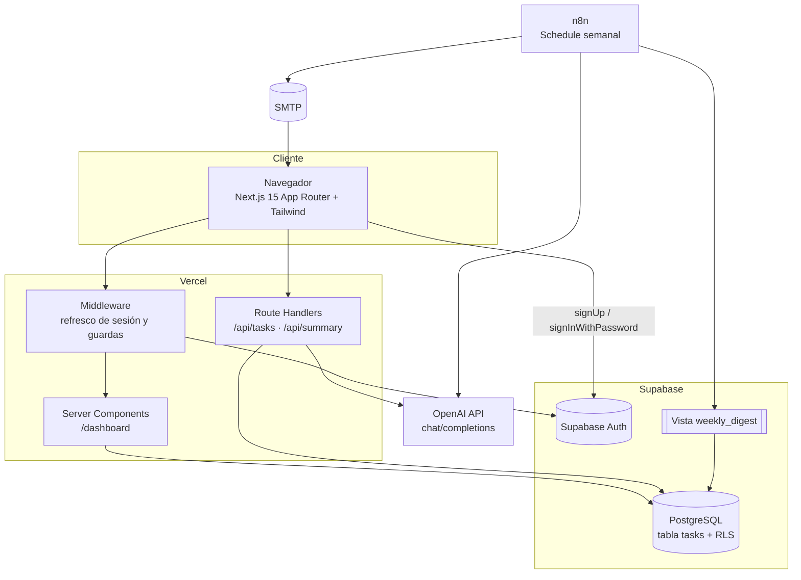
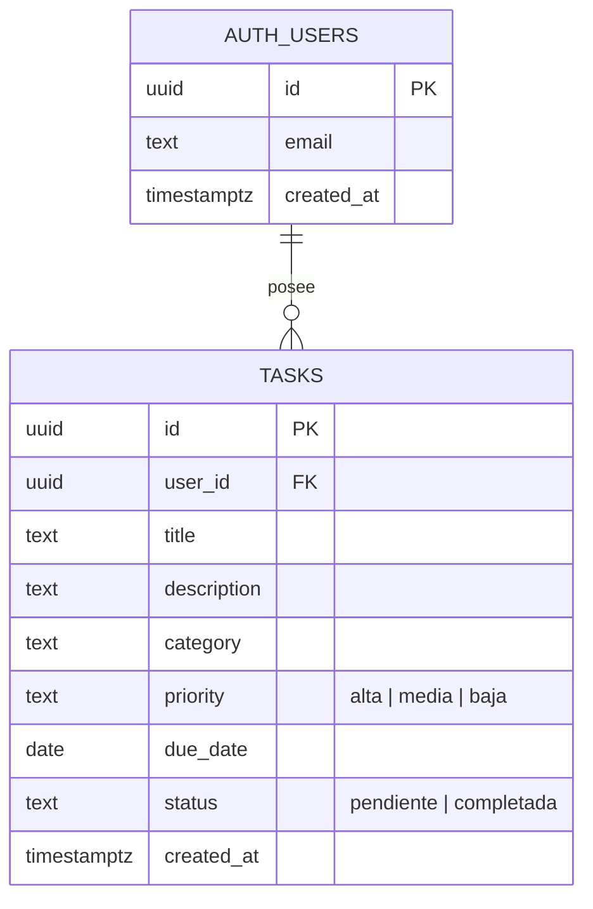
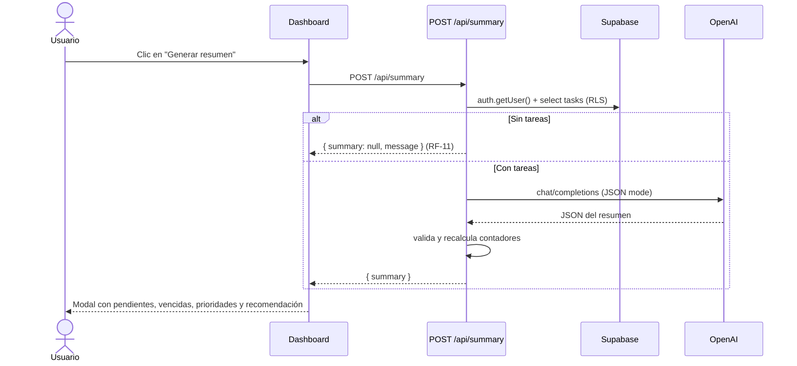

# Arquitectura · TaskFlow AI

## Diagrama de arquitectura

## Diagrama entidad-relación

## Capas y responsabilidades

| Capa | Ubicación | Responsabilidad |
| --- | --- | --- |
| Presentación | `src/app`, `src/components` | Pantallas, modales y estado de UI. Sin lógica de negocio. |
| Estado de cliente | `src/hooks` | `useTasks` y `useSummary` encapsulan las llamadas HTTP y el estado. |
| Aplicación | `src/app/api`, `src/lib/ai/summary-service.ts` | Autenticación de la petición, validación y orquestación del caso de uso. |
| Dominio | `src/lib/tasks`, `src/lib/ai/prompt.ts` | Funciones puras: filtros, contadores, vencimientos, prompt. 100 % testeables. |
| Infraestructura | `src/lib/supabase`, `src/lib/ai/openai-summary-generator.ts` | Clientes de Supabase y OpenAI. |

### Decisiones de diseño

- **Inversión de dependencias**: el caso de uso depende de la interfaz
  `SummaryGenerator`, no de OpenAI. Los tests inyectan un doble determinista y
  cambiar de proveedor solo requiere una nueva implementación.
- **Los contadores no los decide la IA**: `pending_count` y `overdue_count` se
  recalculan en `summary-parser.ts` a partir de la base de datos, para que el
  resumen nunca muestre números inventados.
- **Seguridad en la base de datos**: todas las consultas usan la `anon key` con la
  sesión del usuario, por lo que RLS es la última línea de defensa incluso si una
  ruta de API tuviera un fallo.
- **Rendimiento (RNF-01)**: índices por `user_id`, `status`, `category` y
  `due_date`; el dashboard se renderiza en el servidor con los datos ya cargados y
  las mutaciones actualizan el estado local sin recargar la lista completa.

## Flujo de datos del resumen (RF-07 / RF-09)

