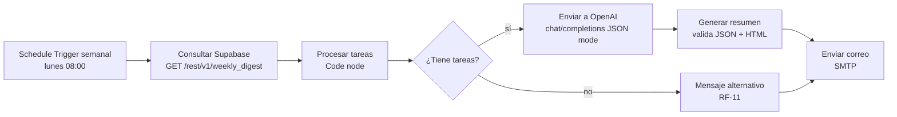

# Automatización semanal en n8n (RF-08, RF-10, RF-11)

`workflow.json` contiene el flujo completo listo para importar en n8n
(**Workflows → Import from File**).

## Flujo

## Nodos

| Nodo | Tipo | Qué hace |
| --- | --- | --- |
| Schedule Trigger semanal | `scheduleTrigger` | Se ejecuta cada lunes a las 08:00 (zona horaria de la instancia n8n). |
| Consultar Supabase | `httpRequest` | Llama a la vista `public.weekly_digest` vía PostgREST con la `service_role key`. Devuelve **una fila por usuario** con sus tareas de la semana en JSON (usuarios sin tareas incluidos). |
| Procesar tareas | `code` | Calcula pendientes y vencidas, ordena por urgencia (vencidas → prioridad → fecha) y construye los mensajes `system`/`user` del prompt. |
| ¿Tiene tareas? | `if` | Separa usuarios con tareas de usuarios sin tareas. |
| Enviar a OpenAI | `httpRequest` | `POST https://api.openai.com/v1/chat/completions` con `response_format: json_object`. |
| Generar resumen | `code` | Valida el JSON devuelto, usa los contadores calculados localmente y arma el correo HTML. |
| Mensaje alternativo | `code` | RF-11: correo alternativo cuando el usuario no tiene tareas. |
| Enviar correo | `emailSend` | Envío por SMTP con la credencial `SMTP TaskFlow AI`. |

## Variables de entorno de la instancia n8n

| Variable | Descripción |
| --- | --- |
| `SUPABASE_URL` | `https://<proyecto>.supabase.co` |
| `SUPABASE_SERVICE_ROLE_KEY` | Service role key (solo en n8n, nunca en el frontend). |
| `OPENAI_API_KEY` | Clave de OpenAI. |
| `OPENAI_MODEL` | Opcional, por defecto `gpt-4o-mini`. |
| `SMTP_FROM` | Remitente, p. ej. `TaskFlow AI <no-reply@tudominio.com>`. |

> En n8n self-hosted las variables se leen con `$env`. Requiere
> `N8N_BLOCK_ENV_ACCESS_IN_NODE=false` (valor por defecto). En n8n Cloud sustituye
> las expresiones `$env.X` por credenciales o variables del entorno de trabajo.

## Credencial SMTP

Crea una credencial **SMTP** llamada `SMTP TaskFlow AI` con host, puerto (587 con
STARTTLS o 465 con SSL), usuario y contraseña de tu proveedor. El nodo
`Enviar correo` la referencia por nombre.

## Puesta en marcha

1. Ejecuta `supabase/schema.sql` en tu proyecto Supabase (crea la vista `weekly_digest`).
2. Importa `workflow.json` en n8n.
3. Configura las variables de entorno y la credencial SMTP.
4. Ejecuta el flujo manualmente (**Execute Workflow**) para validarlo.
5. Actívalo: a partir de ahí corre sin intervención manual (RNF-05).

## Pruebas manuales recomendadas

- Usuario con tareas vencidas → el correo muestra el contador en rojo y prioridades.
- Usuario sin tareas → recibe el correo alternativo de RF-11.
- Corta la clave de OpenAI → el flujo falla en el nodo HTTP y n8n registra el error
  en **Executions** sin enviar correos incompletos.
